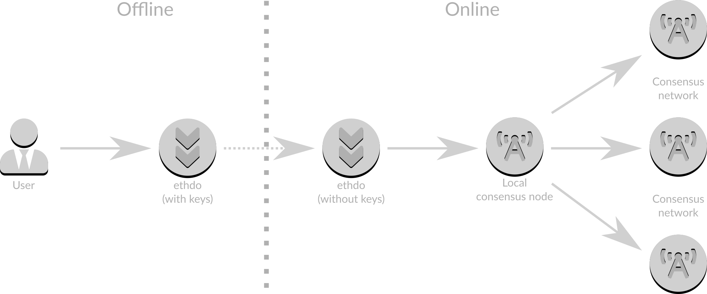

# Changing withdrawal credentials
When creating a validator it is possible to set its withdrawal credentials to those based upon a BLS private key (known as BLS withdrawal credentials, or "type 0" withdrawal credentials) or based upon an Ethereum execution address (known as execution withdrawal credentials, or "type 1" withdrawal credentials).  With the advent of the Capella hard fork, it is possible for rewards accrued on the consensus chain (also known as the beacon chain) to be sent to the execution chain.  However, for this to occur the validator's withdrawal credentials must be type 1.  Capella also brings a mechanism to change existing type 0 withdrawal credentials to type 1 withdrawal credentials, and this document outlines the process to change withdrawal credentials from type 0 to type 1 so that consensus rewards can be accessed.

**Once a validator has Ethereum execution credentials set they cannot be changed.  Please be careful when following this or any similar process to ensure that you have access to the private key (either as a software file, a hardware key or a mnemonic) of the withdrawal address you use so that you have the ability to access your rewards.**

## Concepts
The following concepts are useful when understanding the rest of this guide.

### Validator
A validator is a logical entity that secures the Ethereum beacon chain (and hence the execution chain) by proposing blocks and attesting to blocks proposed by other validators.

### Withdrawal credentials
Withdrawal credentials, held as part of a validator's on-chain definition, define where consensus rewards will be sent.

### Private key
A private key is a hexadecimal string (_e.g._ 0x010203…a1a2a3) that can be used to generate a public key and (in the case of the execution chain) Ethereum address.

### Mnemonic
A mnemonic is a 24-word phrase that can be used to generate multiple private keys with the use of _paths_.  Mnemonics are supported in the following languages:
* chinese simplified
* chinese traditional
* czech
* english
* french
* italian
* japanese
* korean
* spanish

### Path
A path is a string starting with "m" and containing a number of components separated by "/", for example "m/12381/3600/0/0".  The process to obtain a key from a mnemonic and path is known as "hierarchical derivation".

### Withdrawal address
A withdrawal address is an Ethereum execution address that will receive consensus rewards periodically during the operation of the validator and, ultimately, to which the initial deposit will be returned when the validator is exited.  It is important to understand that at time of writing this value cannot be changed, so it is critical that one of the following criteria are met:

- the private keys for the Ethereum address are known
- the Ethereum address is secured by a hardware wallet
- the Ethereum address is that of a smart contract with the ability to withdraw funds

The execution address must be supplied in [EIP-55](https://eips.ethereum.org/EIPS/eip-55) format, _i.e._ using mixed case for checksum.  An example of a mixed-case Ethereum address is `0x8f0844Fd51E31ff6Bf5baBe21DCcf7328E19Fd9F`

### Online and Offline
An _online_ computer is one that is is connected to the internet.  It should be running a consensus node connected to the larger Ethereum network.  An online computer is required to carry out the process, to obtain information from the consensus node and to broadcast your actions to the rest of the Ethereum network.

An _offline_ computer is one that is not connected to the internet.  As such, it will not be running a consensus node.  It can optionally be used in conjunction with an online computer to provide higher levels of security for your mnemonic or private key, but is less convenient because it requires manual transfer of files from the online computer to the offline computer, and back.

With only an online computer the flow of information is roughly as follows:


Here it can be seen that a copy of `ethdo` with access to private keys connects to a consensus node with access to the internet.  Due to its connection to the internet it is possible that the computer on which `ethdo` and the consensus node runs has been compromised, and as such would expose the private keys to an attacker.

With both an offline and an online computer the flow of information is roughly as follows:



Here the copy of `ethdo` with access to private keys is on an offline computer, which protects it from being compromised via the internet.  Data is physically moved from the offline to the online computer via a USB storage key or similar, and none of the information on the online computer is sensitive.

## Preparation
Regardless of the method selected, preparation must take place on the online computer to ensure that `ethdo` can access your consensus node.  `ethdo` will attempt to find a local consensus node automatically, but if not then an explicit connection value will be required.  To find out if `ethdo` has access to the consensus node run:

```sh
ethdo node info
```

The result should be something similar to the following:

```
Syncing: false
```

Alternatively, the result may look like this:

```
No connection supplied; using mainnet public access endpoint
Syncing: false
```

which means that a local consensus node was not accessed and instead a public endpoint specifically assigned to handle these operations was used instead.  If you do have a local consensus node but see this message it means that the local node could not be accessed, usually because it is running on a non-standard port.  If this is the case for your configuration, you need to let `ethdo` know where the consensus node's REST API is.  For example, if your consensus node is serving its REST API on port 12345 then you should add `--connection=http://localhost:12345` to all `ethdo` commands in this process, for example:

```sh
ethdo --connection=http://localhost:12345 node info
```

Note that some consensus nodes may require configuration to serve their REST API.  Please refer to the documentation of your specific consensus node to enable this.

Regardless of your method used above, it is important to confirm that the "Syncing" value is "false".  If this is "true" it means that the node is currently syncing, and you will need to wait for the process to finish before proceeding.

Once the preparation is complete you should select either basic or advanced operation, depending on your requirements.

## Basic operation
Given the above concepts, the purpose of this guide is to allow a change of validators' withdrawal credentials to be changed to a withdrawal address, allowing validator rewards to be accessed on the Ethereum execution chain.

Basic operation is suitable in the majority of cases.  If you:

- generated your validators using a mnemonic (_e.g._ using the deposit CLI or launchpad)
- want to change all of your validators to have the same withdrawal address
- want to change all of your validators' withdrawal credentials at the same time

then this method is for you.  If any of the above does not apply then please go to the "Advanced operation" section.

### Online process
The online process generates and broadcasts the operations to change withdrawal credentials for all of your validators tied to a mnemonic in a single action.

Two pieces of information are required for carrying out this process online: the mnemonic and withdrawal address.

On your _online_ computer run the following:

```
ethdo validator credentials set --mnemonic="abandon abandon abandon … art" --withdrawal-address=0x0123…cdef
```

Replacing the `mnemonic` and `withdrawal-address` values with your own values.  This command will:

1. obtain information from your consensus node about all currently-running validators and various additional information required to generate the operations
2. scan your mnemonic to find any validators that were generated by it, and create the operations to change their credentials
3. broadcast the credentials change operations to the Ethereum network

### Online and Offline process
The online and offline process contains three steps.  In the first, data is gathered on the online computer.  In the second, the credentials change operations are generated on the offline computer.  In the third, the operations are broadcast on the online computer.

Two pieces of information are required for carrying out this process online: the mnemonic and withdrawal address.

On your _online_ computer run the following:

```
ethdo validator credentials set --prepare-offline
```

This command will:

1. obtain information from your consensus node about all currently-running validators and various additional information required to generate the operations
2. write this information to a file called `offline-preparation.json`

The `offline-preparation.json` file must be copied to your _offline_ computer.  Once this has been done, on your _offline_ computer run the following:

```
ethdo validator credentials set --offline --mnemonic="abandon abandon abandon … art" --withdrawal-address=0x0123…cdef
```

Replacing the `mnemonic` and `withdrawal-address` values with your own values.  This command will:

1. read the `offline-preparation.json` file to obtain information about all currently-running validators and various additional information required to generate the operations
2. scan your mnemonic to find any validators that were generated by it, and create the operations to change their credentials
3. write this information to a file called `change-operations.json`

The `change-operations.json` file must be copied to your _online_ computer.  Once this has been done, on your _online_ computer run the following:

```
ethdo validator credentials set
```

This command will:

1. read the `change-operations.json` file to obtain the operations to change the validators' credentials
2. broadcast the credentials change operations to the Ethereum network

## Advanced operation
Advanced operation is required when any of the following conditions are met:

- your validators were created using something other than the deposit CLI or launchpad (_e.g._ `ethdo`)
- you want to set your validators to have different withdrawal addresses
- you want to change your validators' withdrawal credentials individually

### Validator reference
There are three options to reference a validator:

- the `ethdo` account of the validator (in format wallet/account)
- the validator's public key (in format 0x…)
- the validator's on-chain index (in format 123…)

Any of these can be passed to the following commands with the `--validator` parameter.  You need to ensure that you have this information before starting the process.

**In the following examples we will use the validator with index 123.  Please replace this with the reference to your validator in all commands.**

### Withdrawal address
The withdrawal address is defined above in the concepts section.

**In the following examples we will use a withdrawal address of 0x8f…9F.  Please replace this with the your withdrawal address in all commands.**

### Generating credentials change operations
Note that if you are carrying out this process offline then you still need to carry out the first and third steps outlined in the "Basic operation" section above.  This is to ensure that the offline computer has the correct information to generate the operations, and that the operations are made available to the online computer for broadcasting to the network.

If using the online and offline process run the commands below on the offline computer, and add the `--offline` flag to the commands below.  You will need to copy the resultant `change-operations.json` file to the online computer to broadcast to the network.

If using the online process run the commands below on the online computer.  The operation will be broadcast to the network automatically.

#### Using a mnemonic and path.
A mnemonic is a 24-word phrase from which withdrawal and validator keys are derived using a _path_.  Commonly, keys will have been generated using two paths:

- m/12381/3600/_i_/0 is the path to a withdrawal key, where _i_ starts at 0 for the first validator, 1 for the second validator, _etc._
- m/12381/3600/_i_/0/0 is the path to a validator key, where _i_ starts at 0 for the first validator, 1 for the second validator, _etc._

however this is only a standard and not a restriction, and it is possible for users to have created validators using paths of their own choice.

```
ethdo validator credentials set --mnemonic="abandon abandon abandon … art" --path='m/12381/3600/0/0/0' --withdrawal-address=0x0123…cdef
```

replacing the path with the path to your _withdrawal_ key, and all other parameters with your own values.

#### Using a mnemonic and validator.
Similar to the previous section, however instead of specifying a path instead the index, public key or account of the validator is provided.

```
ethdo validator credentials set --mnemonic="abandon abandon abandon … art" --validator=123 --withdrawal-address=0x0123…cdef
```

#### Using a mnemonic and withdrawal private key.
If the withdrawal address was created using a non-standard method then it is possible that you have the private key for the withdrawal address.  In this situation you can supply the withdrawal private key.


```
ethdo validator credentials set --mnemonic="abandon abandon abandon … art" --private-key=0x3b…9c
```

Note that it is possible for there to be multiple validators that use the provided private key for a withdrawal address, in which case an operation will be generated for each validator that is eligible for change.

#### Using withdrawal private key only.
Similar to the previous section, however instead of specifying the mnemonic, it will select multiple validators that use provided private key for their withdrawal address.


```
ethdo validator credentials set --private-key=0x3b…9c --withdrawal-address=0x8f…9F
```

#### Using an account
If you used `ethdo` to generate your validator deposit data you will likely have used a separate account to generate the withdrawal credentials.  You can specify the accout of the validator and the accout of the withdrawal credentials to generate and broadcast the credentials change operation with the following command:

```
ethdo validator credentials set --withdrawal-address=0x8f…9F --account=Wallet/Account --withdrawal-account=Withdrawals/Account --passphrase=secret
```

replacing the parameters with your own values.  Note that the passphrase here is the passphrsae of the withdrawal account, not the validator account.

## Confirming the process has succeeded
The final step is confirming the operation has taken place.  To do so, run the following command on an online server:

```sh
ethdo validator credentials get --validator=123
```

The result should start with the phrase "Ethereum execution address" and display the execution address you chose at the beginning of the process, for example:

```
Ethereum execution address: 0x8f0844Fd51E31ff6Bf5baBe21DCcf7328E19Fd9F
```

If the result starts with the phrase "BLS credentials" then it may be that the operation has yet to be incorporated on the chain, please wait a few minutes and check again.  If this continues to be the case please obtain help to understand why the change operation failed to work.
